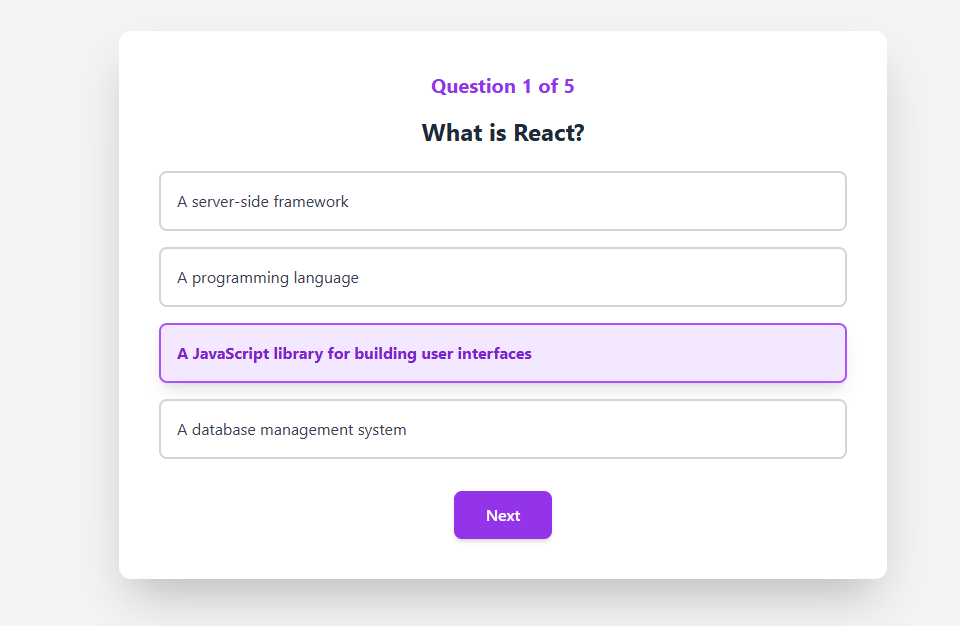

# Micro-Certification Portal

A simple quiz application built with React (frontend) and Express.js (backend) for micro-certifications. Users can take a quiz, get scored, and download a certificate if they pass.

## Features

- User registration with name
- Multiple-choice quiz questions
- Automatic scoring
- Certificate generation and download for passing scores (70% or above)
- Responsive UI with Tailwind CSS

## Tech Stack

- **Frontend**: React, Babel, Tailwind CSS, html2canvas, jsPDF
- **Backend**: Express.js, Node.js
- **Database**: JSON files (quiz.json, users.json, results.json)

## Setup Instructions

### Prerequisites

- Node.js (v14 or higher)
- npm

### Installation

1. Clone the repository:
   ```bash
   git clone <repository-url>
   cd micro-certification-portal
   ```

2. Install backend dependencies:
   ```bash
   cd backend
   npm install
   ```

3. Start the backend server:
   ```bash
   npm start
   ```
   The server will run on http://localhost:3001

4. Open the application:
   - Open your browser and navigate to http://localhost:3001
   - Or serve the frontend separately if needed

### Database

The application uses JSON files for data storage:
- `database/quiz.json`: Quiz questions
- `database/users.json`: Registered users
- `database/results.json`: Quiz results

## Deployment

### Frontend (Vercel)

The frontend is a static React app that can be deployed to Vercel.

1. Build the frontend (if needed, but it's using Babel inline)
2. Deploy the `frontend/` folder to Vercel

### Backend

The backend can be deployed to platforms like Heroku, Railway, or Render.

For Vercel, you can convert the API routes to serverless functions in `api/` directory.

## Screenshots

### Login Page


### Quiz Page


### Results Page


### Certificate


## API Endpoints

- `GET /api/quiz`: Fetch quiz questions
- `POST /api/register`: Register a user
- `POST /api/results`: Submit quiz results

## License

MIT License
